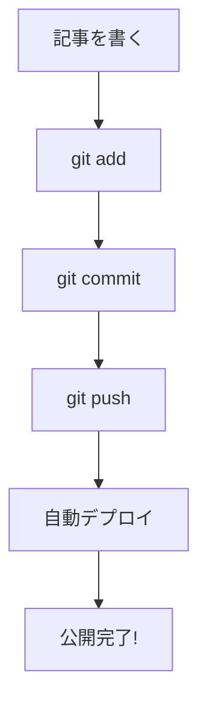
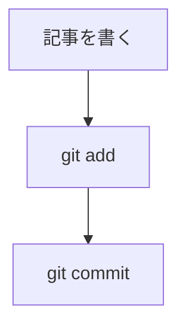

## 概要

このブログはGitリポジトリ内のMarkdownファイルで記事を管理しています。新しい記事を投稿するには、Markdownファイルを作成してGitHubにプッシュするだけです。

## 記事の作成手順

### 1. Markdownファイルを作成

`content/posts/` ディレクトリに `.md` ファイルを作成します。ファイル名がURLのスラッグになります。

```bash
# 例: /posts/my-first-article というURLになる
touch content/posts/my-first-article.md
```

### 2. フロントマターを記述

ファイルの先頭にYAML形式のメタデータを記述します。

```yaml
---
title: "記事のタイトル"
emoji: "🚀"
type: "tech"
topics: ["TypeScript", "React"]
published: true
category: "Frontend"
date: "2026-02-21"
coverImage: "/images/posts/my-image.jpg"
description: "記事の概要を1〜2文で書きます。"
---
```

### フロントマター項目一覧

| 項目 | 型 | 必須 | 説明 |
|---|---|---|---|
| `title` | string | はい | 記事のタイトル |
| `emoji` | string | はい | 記事を表す絵文字（カバー画像がない場合に表示） |
| `type` | `"tech"` or `"idea"` | はい | 記事の種類 |
| `topics` | string[] | はい | タグ（配列で指定） |
| `published` | boolean | はい | `true`で公開、`false`で非公開 |
| `category` | string | はい | カテゴリ名 |
| `date` | string | はい | 投稿日（YYYY-MM-DD形式） |
| `updated` | string | いいえ | 更新日 |
| `featured` | boolean | いいえ | `true`でヒーローセクション・注目記事に表示 |
| `series` | string | いいえ | シリーズ名（連載記事の場合） |
| `seriesOrder` | number | いいえ | シリーズ内の順番 |
| `coverImage` | string | いいえ | カバー画像のパス（`/images/posts/` 配下に配置） |
| `description` | string | いいえ | 記事の概要（一覧カードに表示される） |

### 3. 本文を書く

フロントマターの下にMarkdownで本文を記述します。

## Markdown記法ガイド

### 見出し

```markdown
## 大見出し（h2）
### 中見出し（h3）
```

h2・h3は自動的に目次（サイドバー）に反映されます。

### コードブロック

言語名を指定するとシンタックスハイライトが適用されます。右上に言語ラベルとコピーボタンが表示されます。

```typescript
const greeting: string = "Hello, World!";
console.log(greeting);
```

対応言語: TypeScript, JavaScript, TSX, JSX, HTML, CSS, JSON, Bash, Shell, Python, Rust, Go, YAML, Markdown, SQL, diff

### テーブル

```markdown
| 列1 | 列2 | 列3 |
|-----|-----|-----|
| A   | B   | C   |
```

実際の表示:

| 列1 | 列2 | 列3 |
|-----|-----|-----|
| A   | B   | C   |

### リンク・画像

```markdown
[リンクテキスト](https://example.com)

```

画像は `public/images/posts/` ディレクトリに配置してください。

### タスクリスト

```markdown
- [x] 完了したタスク
- [ ] 未完了のタスク
```

実際の表示:

- [x] 完了したタスク
- [ ] 未完了のタスク

## Qiita互換機能

### ノートブロック

Qiitaと同じ `:::note` 記法が使えます。3種類のスタイルがあります。

:::note info
これは**情報**ボックスです。補足説明や参考情報を伝えるのに使います。
:::

:::note warn
これは**注意**ボックスです。気をつけてほしいポイントを伝えるのに使います。
:::

:::note alert
これは**警告**ボックスです。重要な注意事項や危険な操作について伝えるのに使います。
:::

記法:

````markdown
:::note info
補足情報をここに書きます。
:::

:::note warn
注意書きをここに書きます。
:::

:::note alert
警告をここに書きます。
:::
````

種類を省略すると `info` になります。

### 数式（KaTeX）

インライン数式: $E = mc^2$ は `$E = mc^2$` と書きます。

ブロック数式:

$$
\sum_{i=1}^{n} x_i = x_1 + x_2 + \cdots + x_n
$$

記法:

```markdown
インライン: $E = mc^2$

ブロック:
$$
\sum_{i=1}^{n} x_i = x_1 + x_2 + \cdots + x_n
$$
```

### Mermaid図

コードブロックの言語に `mermaid` を指定すると、図として描画されます。



記法:

````markdown

````

### 折りたたみ（details）

HTMLの `<details>` タグがそのまま使えます。

<details><summary>クリックで展開</summary>

折りたたまれた内容がここに表示されます。Markdown記法もそのまま使えます。

- リスト項目1
- リスト項目2

</details>

### その他の記法

- **太字**: `**テキスト**`
- *斜体*: `*テキスト*`
- ~~打ち消し線~~: `~~テキスト~~`
- `インラインコード`: `` `コード` ``
- リスト: `- 項目` または `1. 項目`
- 引用: `> テキスト`

> これは引用の例です。他の記事や文献からの引用に使います。

## カバー画像の追加

記事カードやヘッダーにカバー画像を表示できます。

1. 画像を `public/images/posts/` に配置
2. フロントマターに `coverImage` を追加

```yaml
coverImage: "/images/posts/my-article-cover.jpg"
```

:::note info
カバー画像がない場合は、`emoji` フィールドの絵文字がカード上に大きく表示されます。
:::

## ローカルプレビュー

投稿前にローカルで確認できます。

```bash
npm run dev
```

ブラウザで http://localhost:3000 を開くと、記事のプレビューが確認できます。

## デプロイ（公開）

記事をGitHubの `main` ブランチにプッシュすると、GitHub Actionsが自動でビルド・デプロイを実行します。

```bash
# 記事と画像をステージング
git add content/posts/my-first-article.md
git add public/images/posts/my-image.jpg

# コミット
git commit -m "Add: 新しい記事を追加"

# プッシュ（自動デプロイ開始）
git push origin main
```

プッシュ後、約2〜3分でサイトに反映されます。

:::note warn
`main` ブランチへのプッシュのみがデプロイをトリガーします。他のブランチでは記事が公開されません。
:::

## 連載記事の作成

複数の記事をシリーズとしてまとめることができます。フロントマターに `series` と `seriesOrder` を指定します。

```yaml
---
title: "React入門 第1回"
series: "React入門"
seriesOrder: 1
---
```

同じ `series` 名を持つ記事が自動的にリンクされ、記事の下部に前後のナビゲーションが表示されます。

## 記事の非公開・下書き

`published: false` に設定すると、ビルド時に記事が生成されなくなります。下書きとして保存しておきたい場合に便利です。

```yaml
---
published: false
---
```

## まとめ

1. `content/posts/` にMarkdownファイルを作成
2. フロントマターでメタデータを設定
3. Markdownで本文を記述（Qiita互換記法も利用可能）
4. `git push origin main` で自動デプロイ

## サンプル：実際のMarkdownファイル全文

以下が実際に投稿できる記事の完成形です。`content/posts/my-first-article.md` としてそのまま使えます。

````markdown
---
title: "TypeScriptで型安全なAPIクライアントを作る"
emoji: "🔐"
type: "tech"
topics: ["TypeScript", "React", "API"]
published: true
category: "Frontend"
date: "2026-02-21"
description: "fetchをラップして型安全なAPIクライアントを実装する方法を解説します。"
---

## はじめに

TypeScriptでAPIを叩くとき、レスポンスの型が `any` になってしまうことはよくあります。
この記事では、型安全なAPIクライアントを作る方法を紹介します。

:::note info
この記事のコードはTypeScript 5.x以降を対象としています。
:::

## 基本的な実装

まずはシンプルなfetchラッパーから始めましょう。

```typescript
async function fetchApi<T>(url: string): Promise<T> {
  const res = await fetch(url);
  if (!res.ok) {
    throw new Error(`HTTP error: ${res.status}`);
  }
  return res.json() as Promise<T>;
}
```

使い方はこうなります。

```typescript
type User = {
  id: number;
  name: string;
  email: string;
};

const user = await fetchApi<User>("/api/users/1");
console.log(user.name); // 型補完が効く！
```

## エラーハンドリングを追加する

:::note warn
本番環境では必ずエラーハンドリングを実装してください。
:::

```typescript
type ApiResult<T> =
  | { ok: true; data: T }
  | { ok: false; error: string };

async function fetchApiSafe<T>(url: string): Promise<ApiResult<T>> {
  try {
    const data = await fetchApi<T>(url);
    return { ok: true, data };
  } catch (e) {
    return { ok: false, error: String(e) };
  }
}
```

## まとめ

- ジェネリクスを使うと型安全なAPIクライアントが作れる
- エラーハンドリングは `Result` 型でまとめると扱いやすい
````
