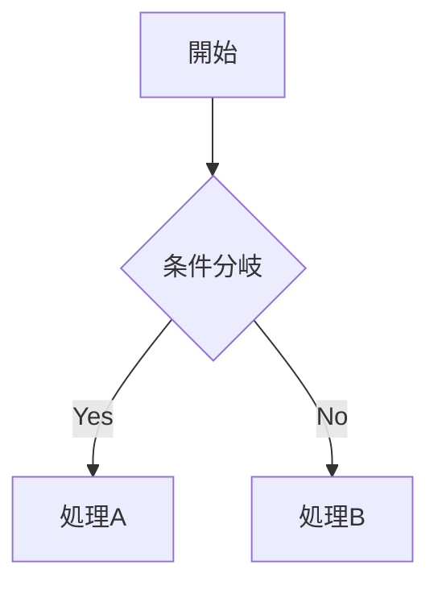

## 概要

このブログはGitリポジトリ内のMarkdownファイルで記事を管理しています。新しい記事を投稿するには、Markdownファイルを作成してGitHubにプッシュするだけです。

## 記事の作成手順

### 1. Markdownファイルを作成

`content/posts/` ディレクトリに `.md` ファイルを作成します。ファイル名がURLのスラッグになります。

```bash
# 例: /posts/my-first-article というURLになる
touch content/posts/my-first-article.md
```

### 2. フロントマターを記述

ファイルの先頭にYAML形式のメタデータを記述します。

```yaml
---
title: "記事のタイトル"
emoji: "🚀"
type: "tech"
topics: ["TypeScript", "React"]
published: true
category: "Frontend"
date: "2026-02-18"
---
```

### フロントマター項目一覧

| 項目 | 型 | 必須 | 説明 |
|---|---|---|---|
| `title` | string | はい | 記事のタイトル |
| `emoji` | string | はい | 記事を表す絵文字 |
| `type` | `"tech"` or `"idea"` | はい | 記事の種類 |
| `topics` | string[] | はい | タグ（配列で指定） |
| `published` | boolean | はい | `true`で公開、`false`で非公開 |
| `category` | string | はい | カテゴリ名 |
| `date` | string | はい | 投稿日（YYYY-MM-DD形式） |
| `updated` | string | いいえ | 更新日 |
| `featured` | boolean | いいえ | `true`でサイドバーの「注目の記事」に表示 |
| `series` | string | いいえ | シリーズ名（連載記事の場合） |
| `seriesOrder` | number | いいえ | シリーズ内の順番 |

### 3. 本文を書く

フロントマターの下にMarkdownで本文を記述します。以下の記法が使えます。

#### 見出し

```markdown
## 大見出し（h2）
### 中見出し（h3）
```

h2・h3は自動的に目次に反映されます。

#### コードブロック

言語名を指定するとシンタックスハイライトが適用されます。コピーボタンも自動で表示されます。

````markdown
```typescript
const greeting = "Hello, World!";
console.log(greeting);
```
````

対応言語: TypeScript, JavaScript, TSX, JSX, HTML, CSS, JSON, Bash, Python, Rust, Go, YAML, Markdown, SQL, diff

#### リンク・画像

```markdown
[リンクテキスト](https://example.com)

```

#### テーブル

```markdown
| 列1 | 列2 | 列3 |
|-----|-----|-----|
| A   | B   | C   |
```

#### ノートブロック（Qiita互換）

Qiitaと同じ `:::note` 記法が使えます。

````markdown
:::note info
これは補足情報です。
:::

:::note warn
これは注意書きです。
:::

:::note alert
これは警告です。
:::
````

`info`（青）、`warn`（黄）、`alert`（赤）の3種類が使えます。種類を省略すると `info` になります。

#### 数式（KaTeX）

Qiitaと同じ数式記法に対応しています。

インライン数式: `$E = mc^2$`

ブロック数式:

```markdown
$$
\sum_{i=1}^{n} x_i = x_1 + x_2 + \cdots + x_n
$$
```

#### Mermaid図

コードブロックの言語に `mermaid` を指定すると、図として描画されます。

````markdown

````

#### 折りたたみ（details）

HTMLの `<details>` タグがそのまま使えます。

```markdown
<details><summary>クリックで展開</summary>

ここに詳細な内容を書きます。

</details>
```

#### 脚注

```markdown
本文中に脚注を付けられます[^1]。

[^1]: これが脚注の内容です。
```

#### その他

- **太字**: `**テキスト**`
- *斜体*: `*テキスト*`
- ~~打ち消し線~~: `~~テキスト~~`
- `インラインコード`: `` `コード` ``
- リスト: `- 項目` または `1. 項目`
- タスクリスト: `- [ ] 未完了` / `- [x] 完了`
- 引用: `> テキスト`

## ローカルプレビュー

投稿前にローカルで確認できます。

```bash
npm run dev
```

ブラウザで http://localhost:3000 を開くと、記事のプレビューが確認できます。

## デプロイ（公開）

記事をGitHubにプッシュすると、GitHub Actionsが自動でビルド・デプロイを実行します。

```bash
# 記事をステージング
git add content/posts/my-first-article.md

# コミット
git commit -m "Add: 新しい記事を追加"

# プッシュ（自動デプロイ開始）
git push origin main
```

プッシュ後、約2〜3分でサイトに反映されます。

## 連載記事の作成

複数の記事をシリーズとしてまとめることができます。フロントマターに `series` と `seriesOrder` を指定します。

```yaml
---
title: "React入門 第1回"
series: "React入門"
seriesOrder: 1
---
```

同じ `series` 名を持つ記事が自動的にリンクされ、記事の下部に前後のナビゲーションが表示されます。

## 記事の非公開

`published: false` に設定すると、ビルド時に記事が生成されなくなります。下書きとして保存しておきたい場合に便利です。

```yaml
---
published: false
---
```

## まとめ

1. `content/posts/` にMarkdownファイルを作成
2. フロントマターでメタデータを設定
3. Markdownで本文を記述
4. `git push origin main` で自動デプロイ

以上で記事の投稿は完了です。
